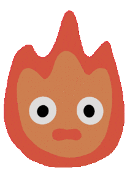
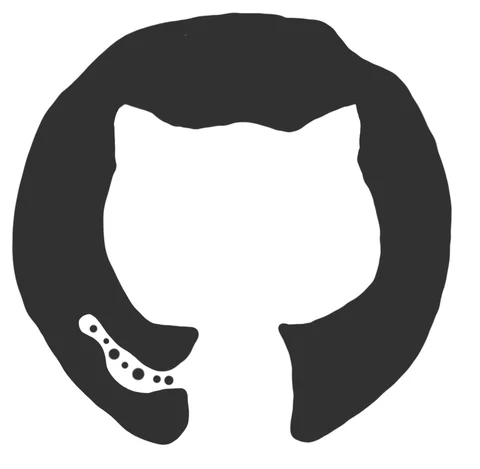

<a>

</a>

<a href="https://git.io/typing-svg"> 

</a>

---
####  About me

```python
#!/usr/bin/python
# -*- coding: utf-8 -*-

class MySelf:

    def __init__(self):
        self.name = '🐻 Gianni\n'
        self.languages = '🇮🇹 it_IT, 🇬🇧 en_GB\n'
        self.education = 'BSc:' \
                         'Degree: 🖥️ Computer Science\n' \
                         'University: ⚜️ Florence\n'
        self.hobbies = '📸 Photography, 🌍 Travelling, 🏃Running\n'
        self.interests = '📗 Book, 🌳 Nature, 📜 History\n'

    def hello(self):
        print(me.name, me.languages, me.education, me.hobbies, me.interests)
        print("Thanks for dropping by, hope you find some of my work interesting.")
        
me = MySelf()
me.hello()
```

---
###  My Github statistics

<a href="https://github.com/JohnnyInArt/">

</a>
<a href="https://github.com/JohnnyInArt/">
  
</a>
